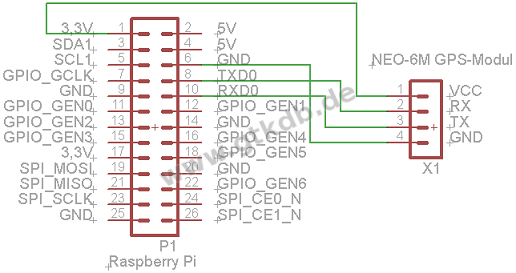
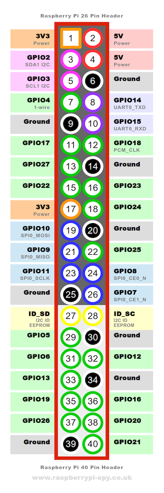
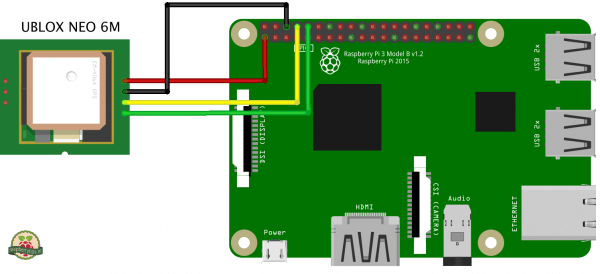

# NEO-6M GPS Module with Raspberry Pi
This is a basic NEO-6M GPS module and Raspberry Pi configuration with python script that can be used as a basis for larger projects

## Getting Started

### 1. Schema

### Raspberry Pi Zero W Schema 





### NEO-6M



### 2. Install the Dependencies
* pip installed.
```
sudo apt-get install python-pip
```
* you will need pynmea2.
```
sudo pip install pynmea2
```
* You need the GPS software
```
sudo apt-get install gpsd gpsd-clients python-gps minicom
```
### 3. Configurate the services
* Serial port modify cmdline.txt:
```
sudo nano /boot/cmdline.txt
```
and replace all with the following lines:
```
dwc_otg.lpm_enable=0 console=tty1 root=/dev/mmcblk0p2 rootfstype=ext4 elevator=deadline fsck.repair=yes rootwait quiet splash plymouth.ignore-serial-consoles
```
* Change startup settings:
```
sudo nano /boot/config.txt
```
and at the end of the file add the following lines:
```
dtparam=spi=on
dtoverlay=pi3-disable-bt
core_freq=250
enable_uart=1
force_turbo=1
init_uart_baud=9600
```
* reboot the system:
```
sudo reboot now
```
* Configure the module for the 9600 rate:
```
stty -F /dev/ttyAMA0 9600
```
* Connect AMA0 to the GPS Software 
First kill the process and add the device to gpsd tool
```
sudo killall gpsd
sudo nano /etc/default/gpsd
```
Edit the file /etc/default/gpsd and add your serial port in DEVICES, like
```
DEVICES="/dev/ttyAMA0"
```
* Restart the Software
```
sudo systemctl enable gpsd.socket
sudo systemctl start gpsd.socket 
sudo cgps -s
```
### 4. Run the Example
These instructions will get you a quick start with the script and please check before if you have the dependencies installed. Also connect the raspberry like the obove schemata.
* Look if the terminal output of the sensor works
```
cat /dev/ttyAMA0
```
or use:
```
cgps -s
```
* Run the script
```
cd Python-NEO-6M-GPS-Raspberry-Pi
sudo python Neo6mGPS.py
```
NOTE: The NEO-6M Module can take up to 20 minutes to find the GPS signal for the first time. Wait until the led light on the module blinks before attempting to run any scripts. After the intial GPS set up, the module will find the signal within a few minutes.
